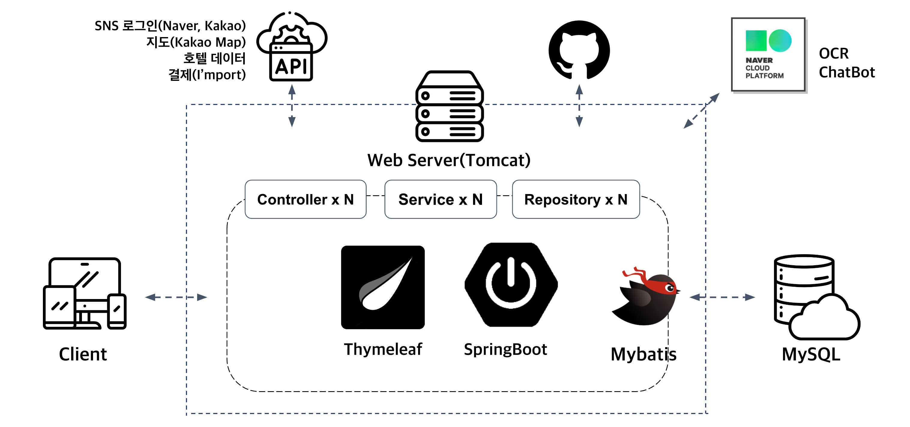
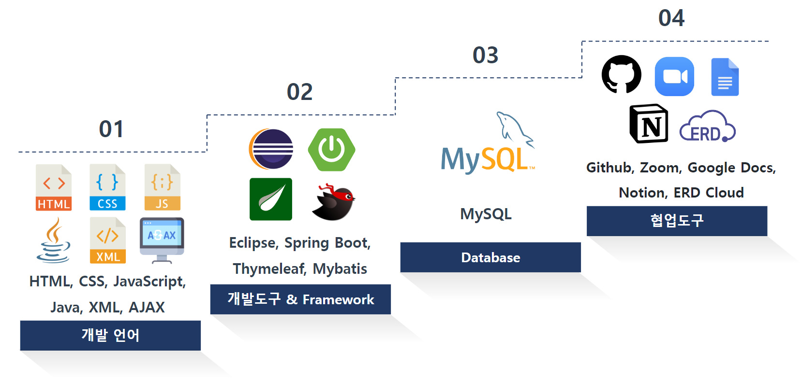
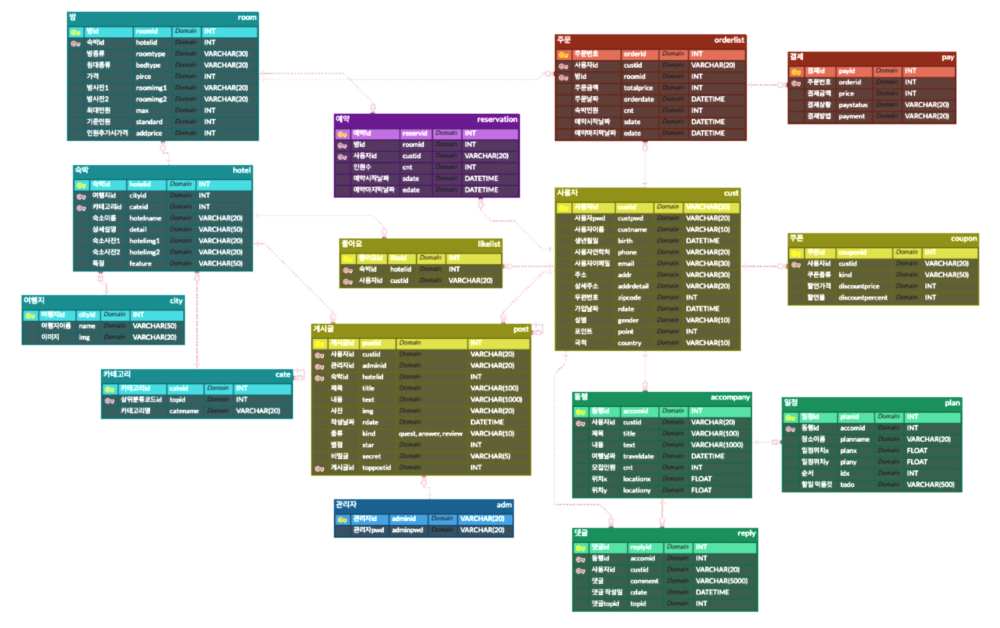
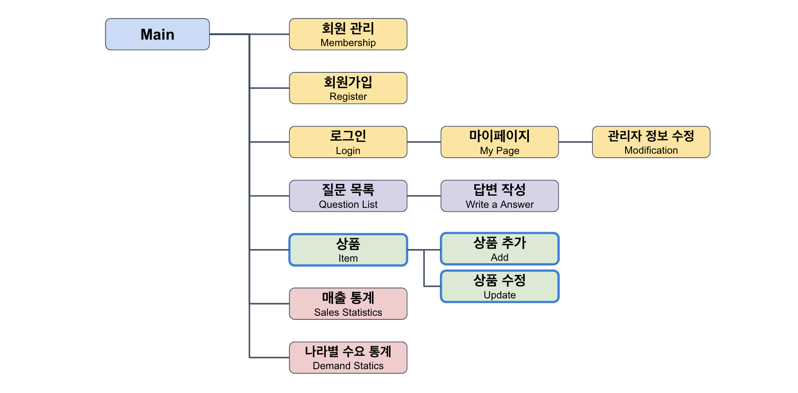
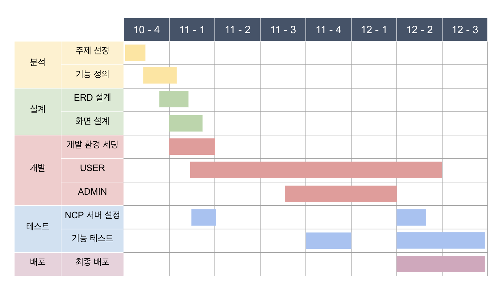

# Witing
Final Project by Team1 FJ

## 1. 프로젝트 주제
- 네이버 AI 플랫폼과 숙박, API(지도,결제,숙박 데이터, 본인인증, SNS 로그인), 웹소켓 활용하여 여행 관련 숙박, 동행 서비스를 제공하는 웹사이트 ‘ Witing : With + -ing ’

## 2. 프로젝트 목적
> 기능 및 협업  
- 트렌드에 맞는 여행지와 숙박시설로 이루어진 숙박상품을 제공하여 취향에 맞는 숙박예약과 동행 서비스를 이용할 수 있는 웹사이트를 개발하는 것 
- 협업을 통해 반응형 웹사이트를 구현
- 숙박 예약 기능과 동행 서비스 기능에 맞는 화면 디자인 및 데이터베이스 설계
- 팀원 모두 프론트와 백엔드 프로세스를 이해하여 프로젝트 완성
- Thymeleaf, MyBatis 를 이용해 동적인 화면 구현
- MySQL을 이용하여 데이터 베이스를 구축하고 Spring Container와 연결
- 자바 개발도구와 통합개발환경(IDE : Intergarated Development Environment) 사용
- ERD Cloud와 Notion, Github을 사용한 협업 경험
> 차별점  
- 동행 게시물을 작성시 다른 사이트와 차별점을 두기 위하여 동행 일정을 동적으로 작성 가능하며, 작성한 일정이 지도에 표시될 수 있도록 구현
- 동행시 성향이 맞는 분과 매칭될 수 있도록 '동행 MBTI' 라는 아이디어를 추가하여 구현

## 3. 시스템 구성도 / 개발 사용 도구

|                            언어                            |                 개발도구                  |    Database    |                           협업도구                           |          Framework          |         Server          |
|:--------------------------------------------------------:|:-------------------------------------:|:--------------:|:--------------------------------------------------------:|:---------------------------:|:-----------------------:|
| Java HTML5 CSS3 JavaScript XML AJAX  | Eclipse 2020-12 SpringBoot 2.7.4  |  MySQL 8.0.17  | Github Zoom Google Docs Notion ERD Cloud | Thymeleaf Mybatis 3.2.2 | NCP(Naver Cloud Platform) Apache Tomcat |

 

## 4. 데이터베이스 설계
> 15개의 테이블 사용  

## 5. 프로젝트 기능 구현
> USER PAGE  

> ADMIN PAGE  

## 6. 프로젝트 구성원 및 역할
| 이름 |                                      
USER PAGE                                      |
ADMIN PAGE|
| :---: |:-------------------------------------------------------------------------------------------:|:---:|
|공통|                       
ERD 설계 및 각 테이블 DTO,CRUD 구현, API 데이터 확인                        |
|김희연| 
메인, 회원가입, 로그인, 쿠폰, 예약/결제 페이지 웹소켓을 통한 실시간 예약반영 기능 NCP chatbot 기능을 이용한 챗봇 문의 기능 |회원가입, 로그인, 나라별 수요 통계차트 페이지|
|배단비|          
상품 목록, 상품 상세, 좋아요, 동행글 목록, 동행글 작성, 댓글 기능, About 페이지 동행 MBTI 기능          |회원 목록/수정 페이지|
|전경민|                      
마이페이지, Q&A 목록/작성, 리뷰 목록/작성 페이지 본인인증 기능                      |Q&A 답변, 매출 통계 차트 페이지|

## 7. 프로젝트 수행 기간
> 2022.10.24 ~ 2022.12.16(8주)

## 8. 웹 구성화면

## 9. 트러블 슈팅
| 이름 | 
Trouble                                                                                                                                                                                                                                                                                          | 
Solution                                                                                                                                                                                                                                                                                                                                                                                                                                                                                                                                                                                                                                                                                                                                                    |
| :---: |----------------------------------------------------------------------------------------------------------------------------------------------------------------------------------------------------------------------------------------------------------------------------------------------------------|---------------------------------------------------------------------------------------------------------------------------------------------------------------------------------------------------------------------------------------------------------------------------------------------------------------------------------------------------------------------------------------------------------------------------------------------------------------------------------------------------------------------------------------------------------------------------------------------------------------------------------------------------------------------------------------------------------------------------------------------------------------------|
|김희연| 프로젝트를 생성하여 테스트를 진행하려고 할 때에 테스트가 진행되지 않음, 원인은 프로젝트 생성시 패키지 명에 예약어인 'final'을 사용함  유저 페이지에서 회원가입을 할 때의 생일을 날짜 형식인 DATE 로 받아오는것에 오류 발생, 원인은 데이터 형식이 맞지 않는다는 오류                                                                                                                                         | 패키지 명을 'multi'로 수정하여 재생성 후 테스트 진행되는 것을 확인하여 깃 리포지토리와 연결  @DateTimeFormat(pattern = "yyyy-MM-dd")를 사용하여 데이터 형식을 맞추어서 회원가입 가능하도록 수정                                                                                                                                                                                                                                                                                                                                                                                                                                                                                                                                                                                                                             |
|배단비| 카카오맵을 사용하기 위해 JS 파일을 추가하였지만 연동되지 않음
 댓글 수정, 삭제 버튼 클릭시 하나만 클릭되는 문제 
페이징 처리 구현시, 글 5개가 한페이지 기준일 때, 게시글이 11~14개인 경우 3페이지가 나타나지 않고 2페이지까지만 나옴.
mbti 검사 했을 때는 클릭시 결과화면을, 검사 안했을 때는 검사화면을 띄우려고 했으나 로그아웃 하려고 하면 type을 찾지 못하는 에러가 발생함(session.logincust.type 사용)
호텔 검색 시, 카테고리와 지역에 해당하는 호텔이 제외되어서 검색됨 | "\
\</div\>"와 javascript 순서 때문에 안 나타나는 것으로 파악하여 JS 전체를 아래로 내림
onclick()을 사용하고 id마다 타임리프를 이용해서 고유한 번호를 부여함, 수정 클릭시 onclick으로 받아온 replyid를 스크립트로 받아와서 부여받은 고유번호를 이용해 출력함 Ex) th:id=”│comment_reply${reply.replyid}│”, th:id="│modal_update${reply.replyid}│”
PageDTO에 전체 마지막 페이지 번호 코드의 괄호를 씌워서 해결  int realEnd = (int)(Math.ceil(total * 1.0) / cri.getAmount()); ↓ int realEnd = (int)(Math.ceil((total * 1.0) / cri.getAmount()));
session.logincust.type을 사용하지 않고 ajax를 이용해서 컨트롤러에 gettype을 생성해서 해결
xml에서 INNER JOIN된 orderlist를 삭제하고 NOT IN으로 예약 날짜된 날짜의 orderlist를 roomid로 가져와서 해결 AND ro.roomid NOT IN (SELECT roomid FROM orderlist WHERE sdate BETWEEN #{sdate} AND #{edate}) |
|전경민| 이메일 본인인증 기능 구현 시 메일 발송 오류                                                                                                                                                                                                                                                                                | 구글 계정으로 이메일을 발송하려면 구글 계정 설정에서 보안 수준이 낮은 앱의 엑세스 허용을 해줘야 하는데, 이 설정을 사용하지 못하도록 2022.06월 경부터 정책이 바뀐것으로 확인하여 계정설정에서 2단계 인증 사용 및 앱 비밀번호를 생성해주어 해결                                                                                                                                                                                                                                                                                                                                                                                                                                                                                                                                                                                                                         |
